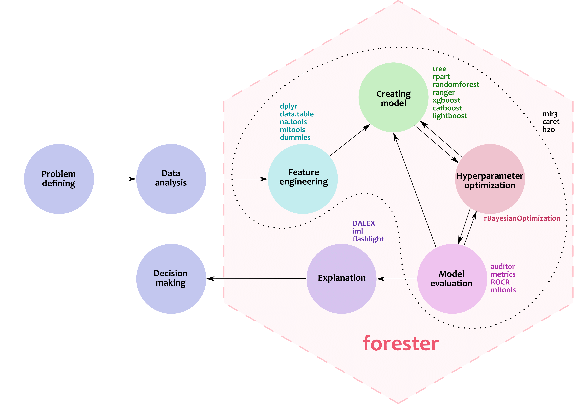
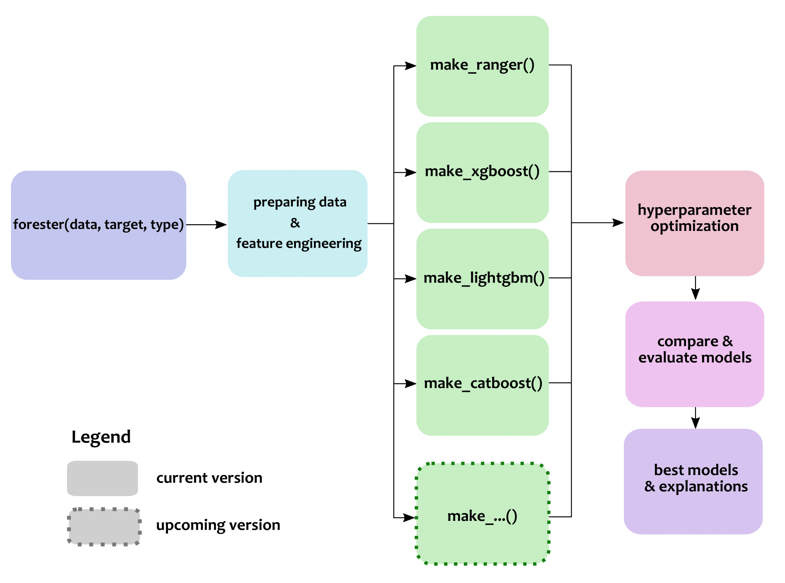

# Automated Machine Learning Model Solver 


_Trees are all you need_

## Overview

`forester` is an R package designed to be intuive, brief in formula, and easy to use. It covers the whole process of creating Machine Learning Models with different known models, such as XGBoost, ranger, LightGBM, CatBoost, etc. in an unified formula which let users to control how core steps work.




## Installation

(From CRAN - not yet available)

``` r
install.packages("forester")
```

From GitHub

``` r
install.packages("devtools")
devtools::install_github("ModelOriented/forester")
```
 

## Usage
Core functions in `forester` package are:
- `forester()`, for automatically creating the whole ML process and returning optimal model.

``` r
data("titanic", package = 'DALEX') 
best_model <- forester(data = titanic, target = "survived", type = "regression",
		       metric = "precision", tune = FALSE)

# Print ranking table for models:
print(best_model)

# The best_model object can be used for giving explanation:
modelStudio::modelStudio(best_model)
```


- `make_...()`, for independently creating model with explanations.

``` r
data("apartments", package = 'DALEX') 
data("apartments_test", package = 'DALEX')
catboost <- make_catboost(apartments, "m2.price", "regression", tune = TRUE, 
		             metric = "rmse") 

# prediction:
apartments_test <- apartments_test[ ,!(colnames(apartments_test) %in% "m2.price"]
predict(catboost, apartments_test)

# explanation:
model_performance(catboost)
plot(model_performance(catboost))
modelStudio::modelStudio(catboost)
```




## References:
- Other functionalities for explanation:
   - [Explainer](https://rdrr.io/cran/DALEX/man/explain.html)
   - [Connection with DALEX family](https://github.com/ModelOriented/DALEX)


This project was implemented by Szymon Szmajdziński and Hoang Thien Ly under the supervision of Anna Kozak and Przemysław Biecek at MI^2 DataLab.
