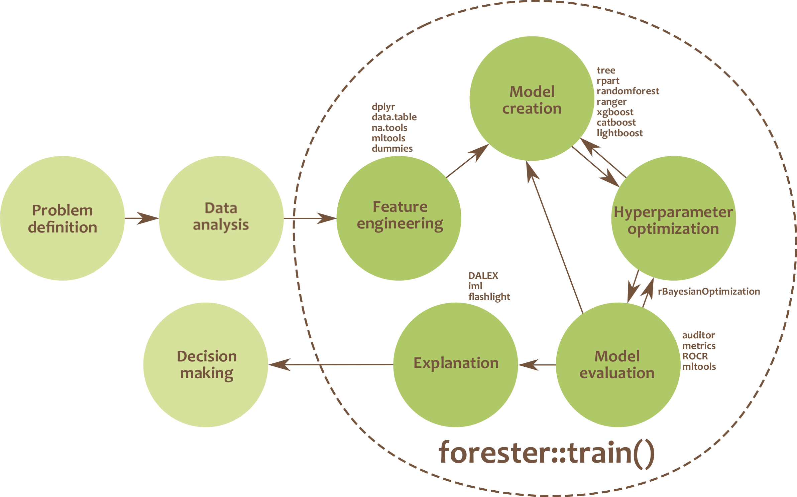

## **forester: Quick and Simple Tools for Training and Testing of Tree-based Models**

A significant amount of time is spent on building models with high performance. Selecting the appropriate model structures, optimizing hyperparameters and explainability are only part of the process of creating a machine learning-based solution. Despite the wide range of structures considered, tree-based models are champions in competitions or hackathons. So, aren't tree-based models enough?

They definitely are and that’s why we want to fully automate the machine learning process for them, so everyone will be able to use the computational power of the trees.

## Installation

From GitHub

``` r
install.packages("devtools")
devtools::install_github("ModelOriented/forester")
```

## How to build tree-based models in R?


## What is the *forester*?

:bulb: full automation of the process of training tree-based models 

:bulb: no demand for ML expertise

:bulb: powerful tool for making high-quality baseline models for experienced users


The *forester* package is **an AutoML tool in R** that wraps up all machine learning processes into a single `train()` function, which includes:

- rendering a brief **data check** report,
- **preprocessing** initial dataset enough for models to be trained,
- **training** 5 tree-based models with default parameters, random search and Bayesian optimisation,
- **evaluating** them and providing a ranked list.




## For whom is this package created?

The  forester  package is designed for beginners in data science, but also for more  experienced users. They get an easy-to-use tool that can be used to prepare high-quality baseline models for comparison with more advanced methods or a set of  
output parameters for more thorough optimisations.

## Notes


## Authors

This package is created inside the MI2.AI (Warsaw University of Technology) as both scientific research and Bachelor thesis by:
- [Adrianna Grudzień](https://github.com/grudzienAda),
- [Hubert Ruczyński](https://github.com/HubertR21), 
- [Patryk Słowakiewicz](https://github.com/PSlowakiewicz).
 
Project co-ordinator and supervisor: [Anna Kozak](https://github.com/kozaka93)

Auxiliary supervisor [Przemysław Biecek]( https://github.com/pbiecek)

The previous version of forester was created by:
- Hoang Thien Ly
- Szymon Szmajdziński
