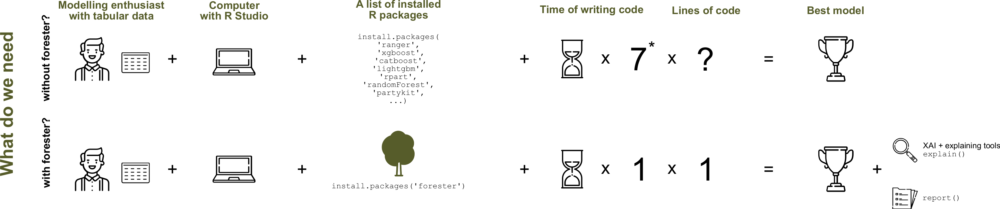

## **forester: Quick and Simple Tools for Training and Testing of Tree-based Models**

A significant amount of time is spent on building models with high performance. Selecting the appropriate model structures, optimizing hyperparameters and explainability are only part of the process of creating a machine learning-based solution. Despite the wide range of structures considered, tree-based models are champions in competitions or hackathons. So, aren't tree-based models enough?

They definitely are and that’s why we want to fully automate the machine learning process for them, so everyone will be able to use the computational power of the trees.

## Installation

From GitHub

``` r
install.packages("devtools")
devtools::install_github("ModelOriented/forester")
```

## Additional features installation

Some of the package dependencies are not present on CRAN, which means that the user has to follow the installation mentioned below. They should be especially helpful for macOS users:

### catboost

The catboost model is used in the `train()` function as an additional engine.

``` r
devtools::install_url('https://github.com/catboost/catboost/releases/download/v1.2.2/catboost-R-Windows-1.2.2.tgz', INSTALL_opts = c("--no-multiarch", "--no-test-load"))
```

If you want to get the latest version of catboost, please take a look at their official website. Alternatively one can do a longer installation, where whole repository will be downloaded.

``` r
devtools::install_github('catboost/catboost', subdir = 'catboost/R-package')
```

### ggradar

The ggradar is required for creating radar plot visualization in the report from the `report()` function.

``` r
devtools::install_github('ricardo-bion/ggradar', dependencies = TRUE)
```

### tinytex

The tinytex is required for creating a report from the `report()` function.

``` r
install.packages('tinytex')
tinytex::install_tinytex()
```

## How to build tree-based models in R?



## What is the *forester*?

:bulb: full automation of the process of training tree-based models 

:bulb: no demand for ML expertise

:bulb: powerful tool for making high-quality baseline models for experienced users


The *forester* package is **an AutoML tool in R** that wraps up all machine learning processes into a single `train()` function, which includes:

- rendering a brief **data check** report,
- **preprocessing** initial dataset enough for models to be trained,
- **training** 5 tree-based models with default parameters, random search and Bayesian optimisation,
- **evaluating** them and providing a ranked list.


## For whom is this package created?

The  forester  package is designed for beginners in data science, but also for more  experienced users. They get an easy-to-use tool that can be used to prepare high-quality baseline models for comparison with more advanced methods or a set of output parameters for more thorough optimization.

## Introductory blogs

- forester: an R package for automated building of tree-based models: https://medium.com/responsibleml/forester-an-r-package-for-automated-building-of-tree-based-models-5e683c7489c
- forester: what makes the package special?: https://medium.com/responsibleml/forester-what-makes-the-package-special-9ece9b8a64d
- forester: predicting house prices use case: https://medium.com/responsibleml/forester-predicting-house-prices-use-case-b537253b6142
- forester: the simplicity of AutoML: https://medium.com/responsibleml/forester-the-simplicity-of-automl-98d9272f3ea

## Authors

Currently (since the version 1.2.0) the package is being developed as both scientific research and Masters thesis at WUT (Warsaw University of Technology), by [Hubert Ruczyński](https://github.com/HubertR21), under the supervision of [Anna Kozak](https://github.com/kozaka93), and [Anna Cena](https://github.com/cenka).


Beforehand (up till the version 1.1.4) this package was created inside the MI2.AI (Warsaw University of Technology) as both scientific research and Bachelor thesis by:
- [Adrianna Grudzień](https://github.com/grudzienAda),
- [Hubert Ruczyński](https://github.com/HubertR21), 
- [Patryk Słowakiewicz](https://github.com/PSlowakiewicz).
 
Project co-ordinator and supervisor: [Anna Kozak](https://github.com/kozaka93)

Auxiliary supervisor [Przemysław Biecek](https://github.com/pbiecek)

The first version of forester was created by:
- Hoang Thien Ly
- Szymon Szmajdziński
